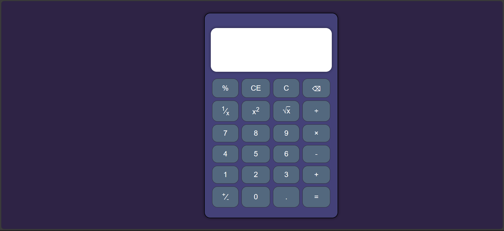
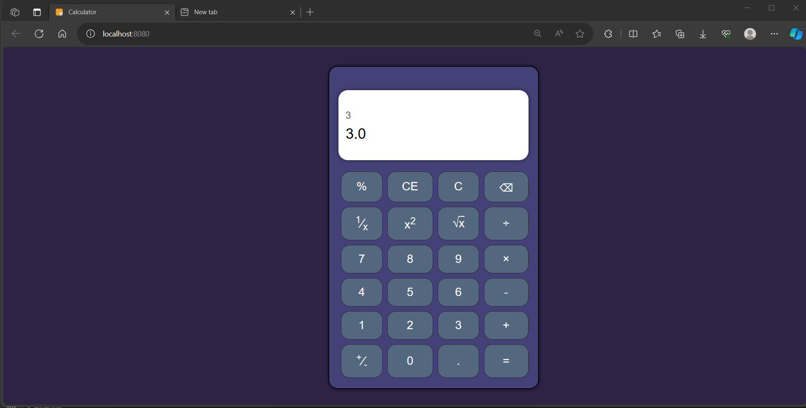
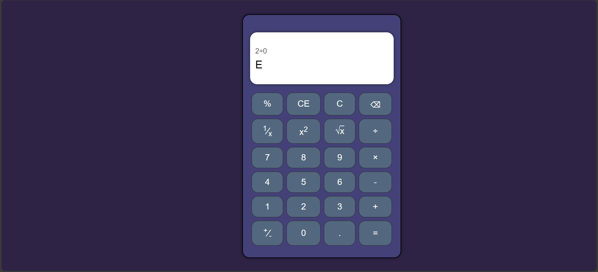

# Assignment #1 OOP: Calculator

## Overview

This document provides a comprehensive guide to the Calculator application. The Calculator is a simple yet powerful tool that allows users to perform basic arithmetic operations, percentage calculations, square roots, and more.

## Features

- Basic arithmetic operations: Addition, subtraction, multiplication, and division.
- Inverse function.
- Percentage calculations.
- Square root and square functions.
- Clear screen functionality.
- Keyboard support for efficient input.



****



## **User Guide**

- **Through** **Buttons**
    - Backspace: Deletes the last character in the input.
    - Percentage (%): Calculates the percentage of the last input.
    - C/CE (Clear): Clears the entire screen.
    - 1/x (Inverse): Calculates the reciprocal of the last input.
    - x^2 (Square): Squares the last input.
    - √x (Square Root): Calculates the square root of the last input.
    - ÷ (Division), × (Multiplication), - (Subtraction), + (Addition): Performs the respective arithmetic operation.
    - ± (Plus/Minus): Changes the sign of the last input.
    - 0-9: Numeric buttons for input.
    - . (Decimal Point): Adds a decimal point to the input.
    - = (Equal): Calculates the result.
- **Through** **Keyboard Shortcuts**
    - 0-9: Input numeric values.
    - *, +, -, /, ^: Perform arithmetic operations.
    - ‘.’ : Input a decimal point.
    - Enter: Calculate the result.
    - Backspace: Delete the last character.
    - Escape (ESC): Clear the screen.
    
    ## **Sample Run:**
    
    
    
    ## **Video Demonstration**
    
    A video demonstration showcasing the Calculator application in action is available. Users can watch the video to understand the functionality and usage.
    
    [Video Demonstration](https://drive.google.com/file/d/1vgtQQLbwvWqydYhacK4DapmYNx_BylI6/view?usp=drive_link)
    
    ---
    
    ## **GitHub Repository**
    
    The source code for the Calculator application is available on GitHub. Developers can access the repository for reference or contribute to its enhancement.
    
    [GitHub Repository](https://github.com/ahmedyoussefg/Web-Calculator)
    
    ---
    
    ## Installation Guide
    
    ## **Prerequisites**
    
    Before installing the Calculator, ensure that you have the following prerequisites installed on your machine:
    
    1. **Java Development Kit (JDK):**
        - Download and install the latest version of JDK from [Oracle](https://www.oracle.com/java/technologies/javase-downloads.html) or use an alternative like OpenJDK.
    2. **Maven:**
        - Install [Maven](https://maven.apache.org/install.html) to manage the project's build and dependencies.
    3. **Node.js and npm:**
        - Download and install [Node.js and npm](https://nodejs.org/) to manage frontend dependencies.
    4. **Vue CLI:**
        - Install [Vue CLI](https://cli.vuejs.org/) globally using npm:
            
            ```bash
            npm install -g @vue/cli
            ```
            
    
    ## **Backend Installation**
    
    1. **Clone the Repository:**
    2. **Build and Run the Spring Boot Application:**
        
        This will start the backend server on **`http://localhost:8081`**.
        
    
    ## **Frontend Installation**
    
    1. **Navigate to the Frontend Directory:**
    2. **Install Vue.js Dependencies:**
        
        ```bash
        npm install
        ```
        
    3. **Run the Vue.js Application:**
        
        ```bash
        npm run serve
        ```
        
        This will start the frontend server on **`http://localhost:8080`**.
        
    4. **Access the Application:**
    Open your web browser and go to [http://localhost:8080](http://localhost:8080/) to use the Calculator.
    
    ## **Optional: Accessing the Backend API**
    
    - The backend API is accessible at **`http://localhost:8081/calculate/`**. You can test it using tools like [Postman](https://www.postman.com/) or integrate it into other applications.
    
    ## **Conclusion**
    
    You have successfully installed the Simple Calculator on your machine. The backend is running on port 8081, and the frontend is accessible at [http://localhost:8080](http://localhost:8080/). Start using the calculator to perform mathematical calculations!
    
    ---
    
    ## **Implementation Details**
    
    - **Front-End:**
        
        The application is built using Vue.js, a JavaScript framework for building user interfaces. The structure consists of components for the calculator screen, buttons, and the main application. The application has a responsive and visually appealing design. The color scheme, button styling, and layout contribute to a user-friendly experience.
        
    - **Back-End:**
        
        The Simple Calculator Spring Boot application is a backend service built to evaluate mathematical expressions using the Spring Expression Language (SpEL). It provides a RESTful API endpoint that accepts mathematical expressions as input, processes them, and returns the computed result.
        
    
    ## **REST API Endpoint**
    
    - **Endpoint:** **`/calculate/`**
    - **Method:** GET
    - **Parameters:**
        - **`expression`** (query parameter): Mathematical expression to be evaluated.
    
    ## **Error Handling**
    
    - The application returns the string "E" to indicate an error, such as division by zero or other evaluation issues.
    
    
    
    
    
    ## **Cross-Origin Resource Sharing (CORS)**
    
    - The application is configured to allow cross-origin requests from **`http://localhost:8080`** to facilitate integration with frontend applications.
    
    ```java
    @CrossOrigin(origins = "http://localhost:8080")
    ```
